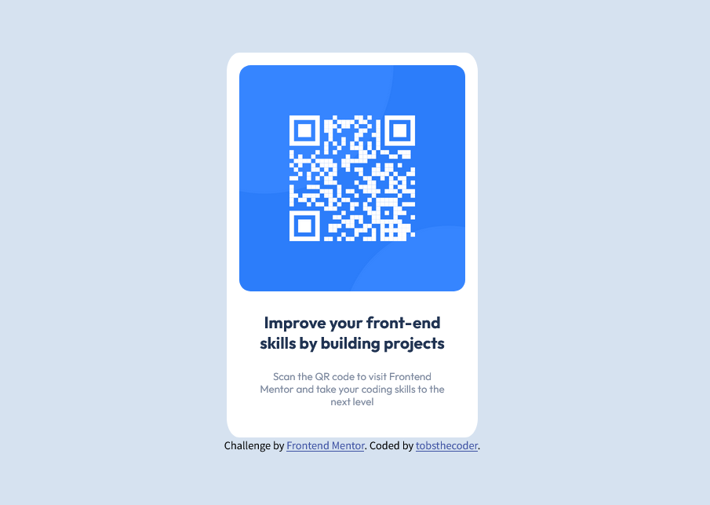

# Frontend Mentor - QR code component solution

This is a solution to the [QR code component challenge on Frontend Mentor](https://www.frontendmentor.io/challenges/qr-code-component-iux_sIO_H).

### Screenshot of project

### Link

- Live Site URL: [livesite](https://devtobs.github.io/QR-code/)

### Built with

- Semantic HTML5 markup
- CSS custom properties
- Flexbox

## Author

- Github - [Tolu](https://github.com/devtobs)
- Frontend Mentor - [@devtobs](https://www.frontendmentor.io/profile/@devtobs)
- Twitter - [@tobsthecoder](https://www.twitter.com/tobsthecoder)
